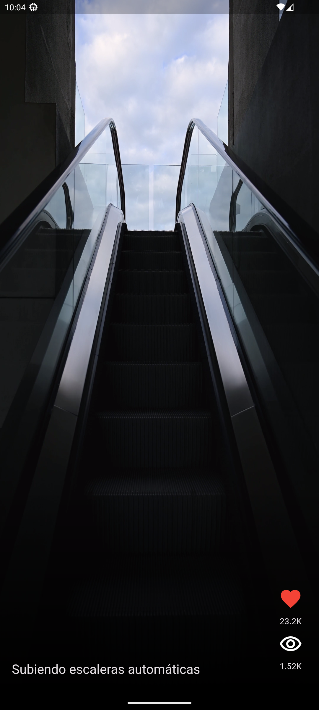
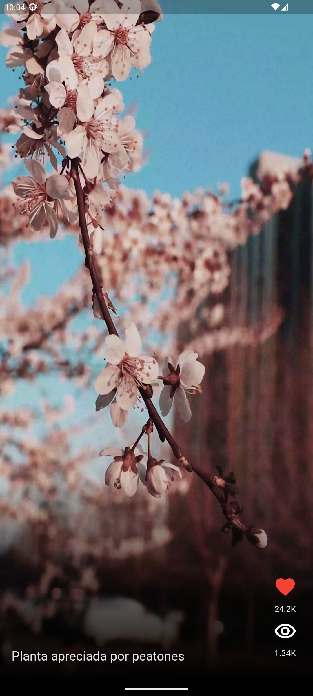
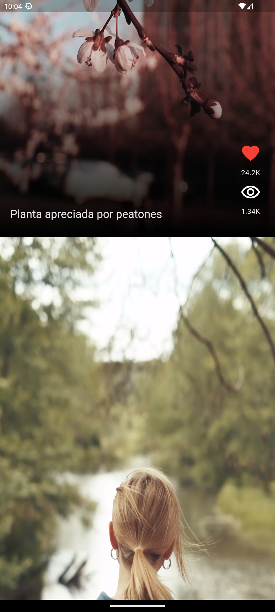

# TokTik - Curso DevTalles

## En este ejemplo se hace uso de:

- Provider
- Custom Widgets
- VideoPlayer
- Gradiente
- Reutilización de Widgets
- Stack y Positioned
- Datasource & Repository 

Para poder usar el ejemplo hay que agregar 7 videos en mp4, nombrados del número 1 al 7

**Emulado en Pixel 8**

